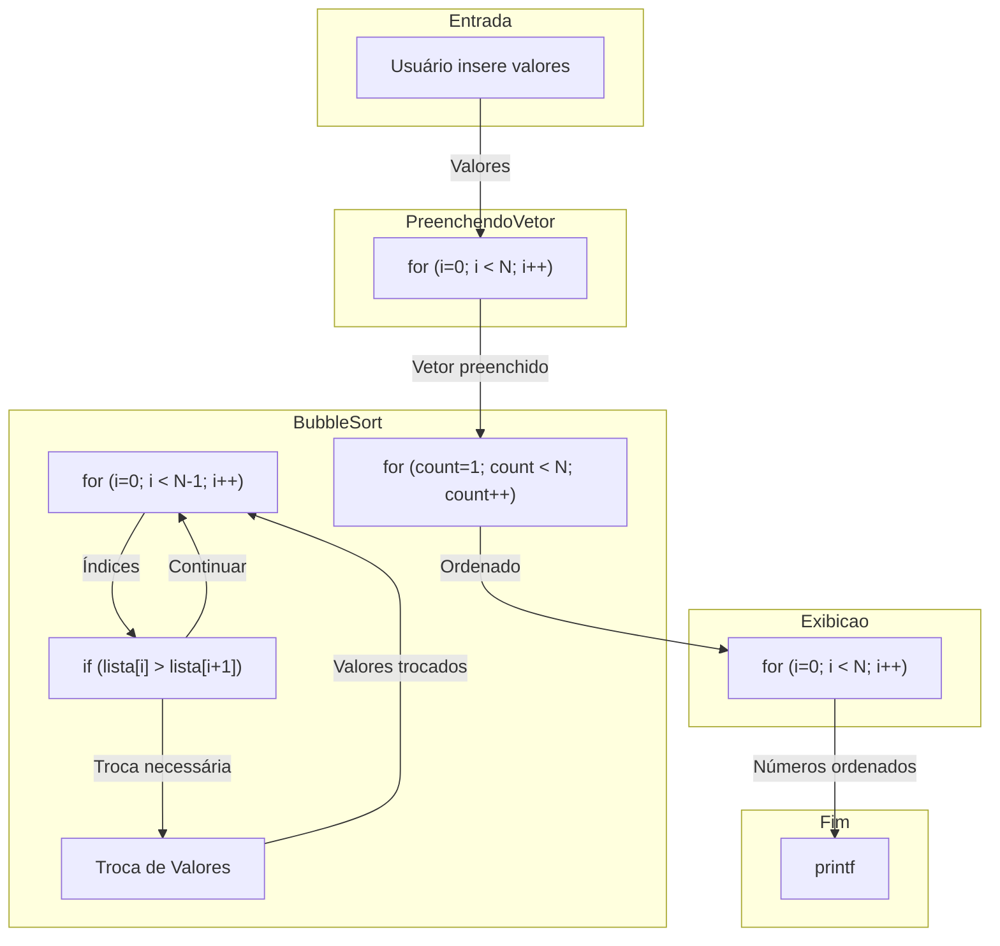

```mermaid

graph TD
    subgraph Entrada
        A[Usuário insere valores]
    end

    subgraph PreenchendoVetor
        B["for (i=0; i < N; i++)"]
    end

    subgraph BubbleSort
        C["for (count=1; count < N; count++)"]
        D["for (i=0; i < N-1; i++)"]
        E["if (lista[i] > lista[i+1])"]
        F[Troca de Valores]
    end

    subgraph Exibicao
        G["for (i=0; i < N; i++)"]
    end

    subgraph Fim
        H[printf]
    end

    A -->|Valores| B
    B -->|Vetor preenchido| C
    D -->|Índices| E
    E -->|Troca necessária| F
    F -->|Valores trocados| D
    E -->|Continuar| D
    C -->|Ordenado| G
    G -->|Números ordenados| H


```