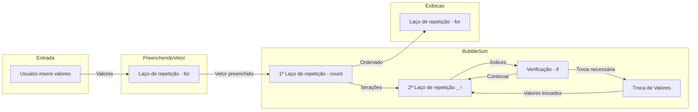

```mermaid

flowchart LR
    subgraph Entrada
        A[Usuário insere valores]
    end

    subgraph PreenchendoVetor
        B[Laço de repetição - for]
    end

    subgraph BubbleSort
        C[1º Laço de repetição - count]
        D[2º Laço de repetição _ i]
        E[Verificação - if]
        F[Troca de Valores]
    end

    subgraph Exibicao
        G[Laço de repetição - for]
    end

    A -->|Valores| B
    B -->|Vetor preenchido| C
    C -->|Iterações| D
    D -->|Índices| E
    E -->|Troca necessária| F
    F -->|Valores trocados| D
    E -->|Continuar| D
    C -->|Ordenado| G


```