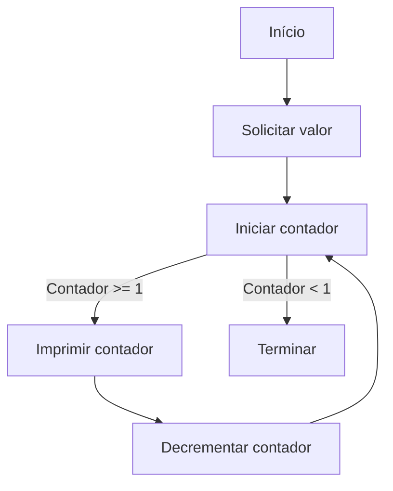

```mermaid
graph TD
    A[Início] --> B[Solicitar valor]
    B --> C[Iniciar contador]
    C --> |Contador >= 1| D[Imprimir contador]
    D --> E[Decrementar contador]
    E --> C
    C --> |Contador < 1| F[Terminar]
    
```