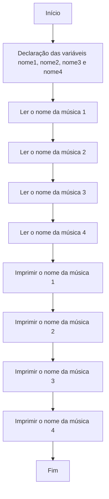

```mermaid
graph TD
    A[Início] --> B[Declaração das variáveis nome1, nome2, nome3 e nome4]
    B --> C[Ler o nome da música 1]
    C --> D[Ler o nome da música 2]
    D --> E[Ler o nome da música 3]
    E --> F[Ler o nome da música 4]
    F --> G[Imprimir o nome da música 1]
    G --> H[Imprimir o nome da música 2]
    H --> I[Imprimir o nome da música 3]
    I --> J[Imprimir o nome da música 4]
    J --> K[Fim]

```